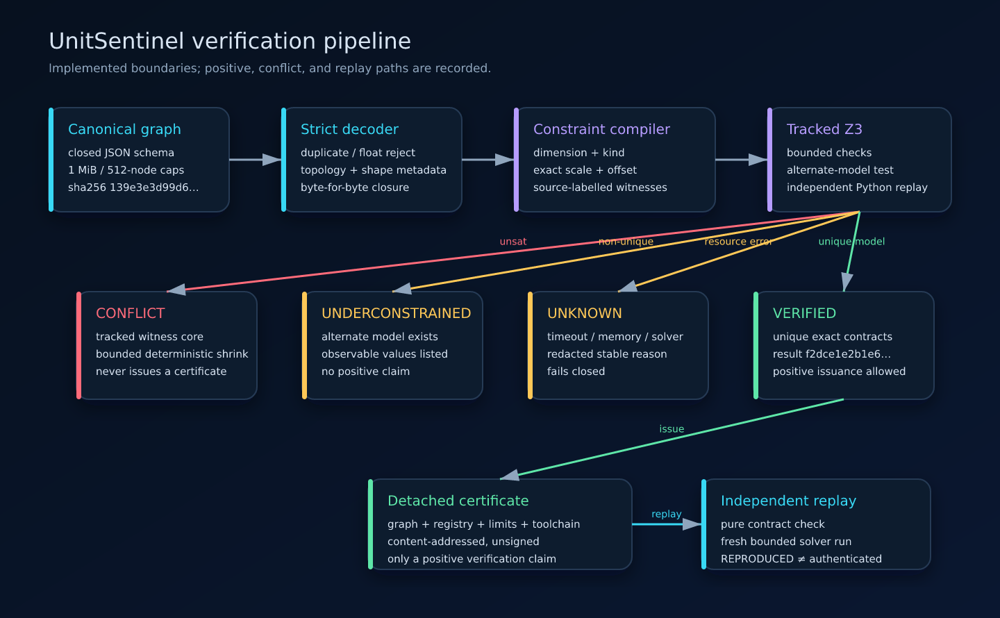
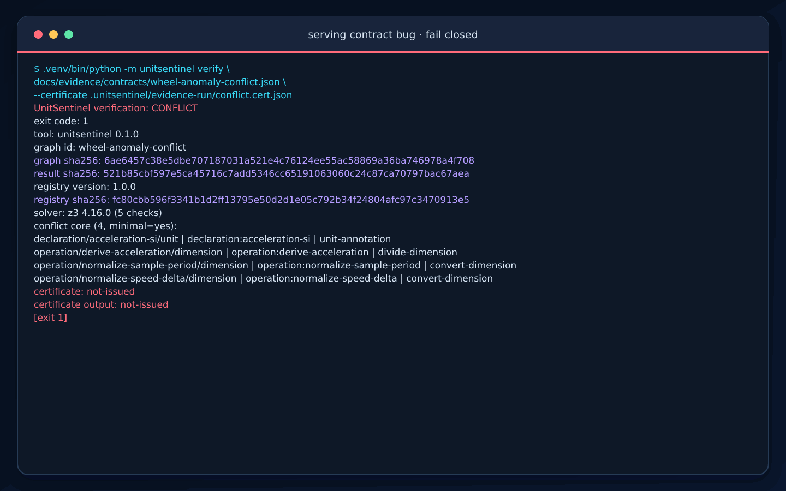
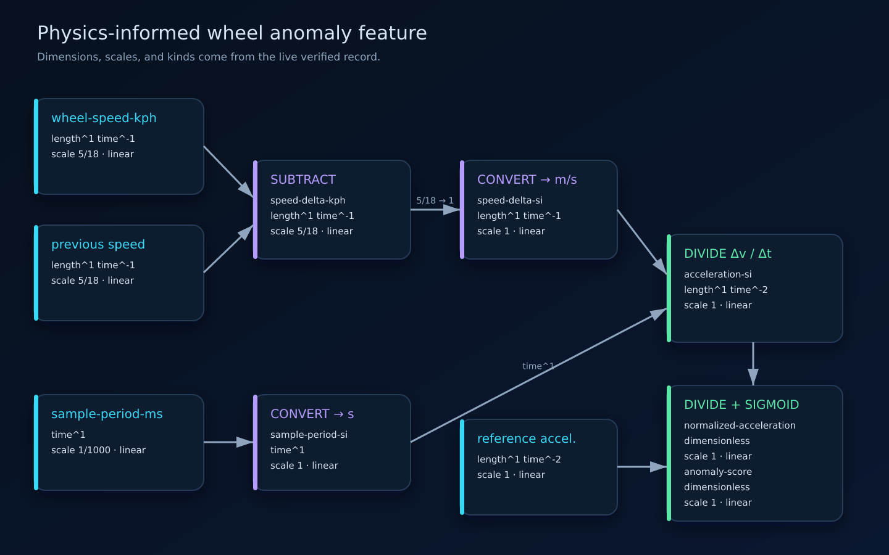
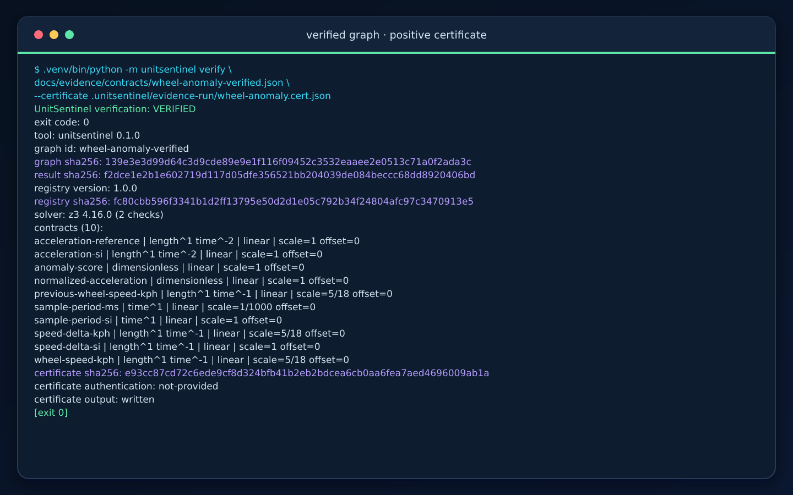
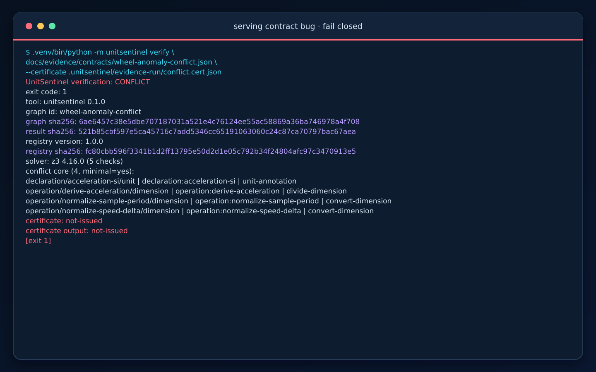
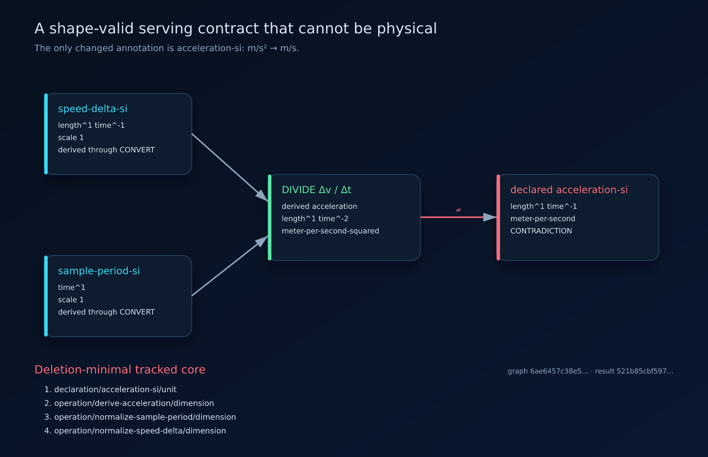
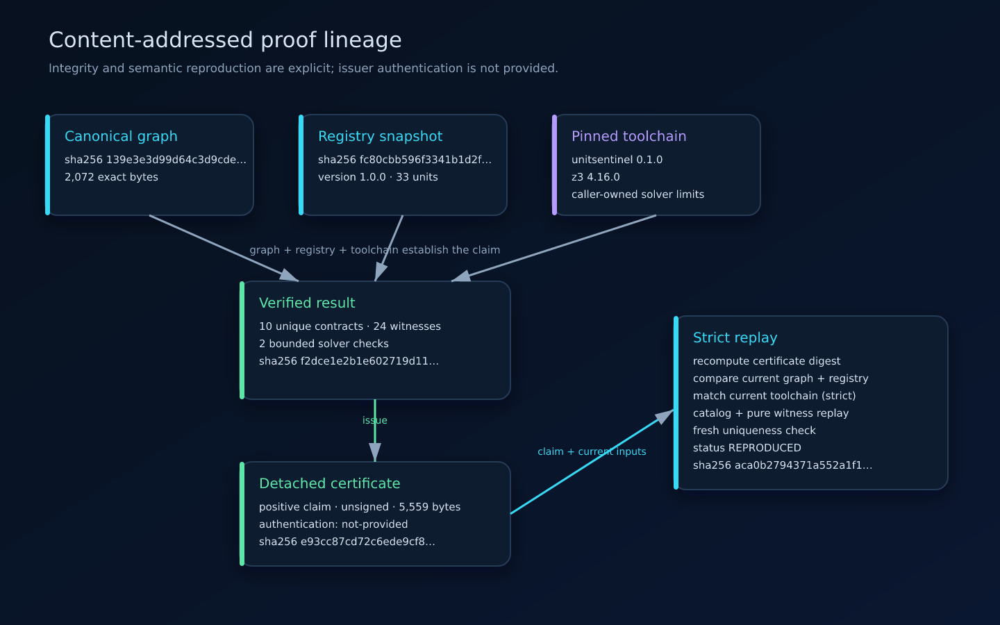
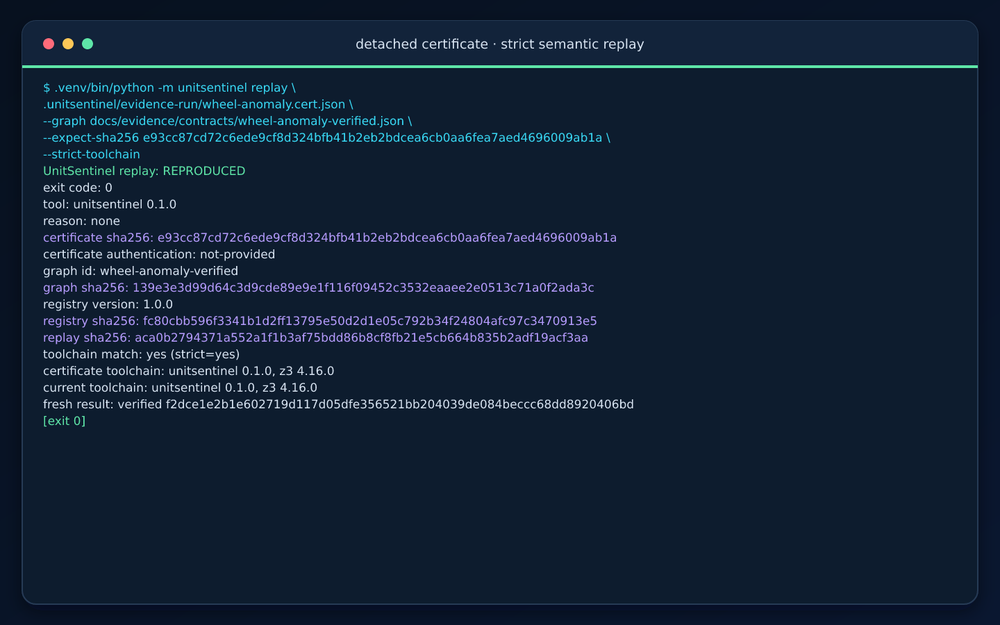
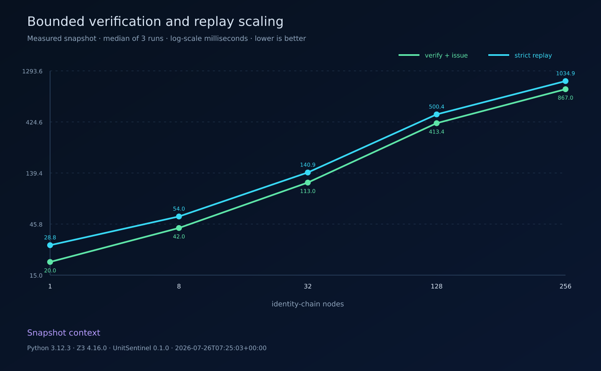

# UnitSentinel

Dimensional proof certificates for scientific and machine-learning computation
graphs.

UnitSentinel catches a class of production bugs that tensor shapes and dtypes
cannot express: a graph can be structurally valid while metres, seconds,
temperature kinds, scales, or offsets are physically incompatible. It compiles
a bounded canonical graph into tracked exact constraints, fails closed unless
every public contract is unique, and can issue an unsigned, content-addressed
certificate for a positive result.

> **Status:** the v0.1 verification core, canonical graph codec, 33-unit
> registry, deterministic CLI, detached certificate codec, and independent
> strict replay are implemented. Bounded repair search, training/serving
> comparison, and ONNX lowering remain future work.



*Current implementation. Canonical bytes cross a bounded decoder; tracked
constraints pass through Z3, exact extraction, and independent semantic replay
before a positive claim can be issued. The [accessible SVG
source](docs/assets/verification-pipeline.svg) contains the same content.*

## A real end-to-end run



*A 7.6-second loop rendered from the exact committed CLI transcripts:
conflict, corrected graph with certificate issuance, then strict replay.
Equivalent text paths are available for
[conflict](docs/evidence/captures/conflict.txt),
[verification](docs/evidence/captures/verify.txt), and
[replay](docs/evidence/captures/replay.txt).*

The demo is not a mock terminal. Its graphs, stdout, exit codes, JSON records,
certificate, frames, and output hashes are all committed in the
[evidence ledger](docs/evidence/README.md).

## The failure mode

Production ML contracts usually preserve tensor dtypes and shapes while the
physical meaning of a feature remains in preprocessing code, prose, or loose
metadata. Several dangerous changes therefore remain structurally valid:

- serving sends `km/h` while training consumed `m/s`;
- an absolute Celsius temperature is treated as a temperature difference;
- a normalization constant comes from a sensor with a different scale;
- two tensors share a shape and dtype but carry incompatible dimensions;
- an exported graph preserves numerical operations but loses the unit contract
  around its inputs and outputs.

[ONNX tensor types](https://onnx.ai/onnx/intro/concepts.html#supported-types)
describe element types and shapes.
[TensorFlow Data Validation](https://www.tensorflow.org/tfx/guide/tfdv) checks
schema properties and statistical skew. UnitSentinel targets another layer:
exact physical dimension, quantity kind, scale, and offset across the
computation itself.

## The example contract

The committed example is a small physics-informed feature pipeline rather than
a toy `metres + seconds` expression:

1. subtract current and previous wheel speed in `km/h`;
2. convert the speed delta to `m/s`;
3. convert the sample period from `ms` to `s`;
4. derive acceleration as `Δv / Δt`;
5. normalize by a reference acceleration;
6. apply a sigmoid only after the value is dimensionless.



*Dimensions, exact scales, and quantity kinds come from the live verified
contract record. UnitSentinel checks the feature contract; it does not execute
the tensors or calculate an anomaly score. [Inspect the accessible
SVG](docs/assets/wheel-anomaly-contract.svg).*

The verified graph is 2,072 canonical bytes and has SHA-256:

```text
139e3e3d99d64c3d9cde89e9e1f116f09452c3532eaaee2e0513c71a0f2ada3c
```

## Install and verify

UnitSentinel supports Python 3.11 and newer.

```bash
python3 -m venv .venv
.venv/bin/python -m pip install -e '.[dev]'

mkdir -p .unitsentinel/demo
.venv/bin/python -I examples/build_wheel_anomaly_contract.py \
    --variant verified \
    > .unitsentinel/demo/wheel-anomaly.json

.venv/bin/python -m unitsentinel verify \
    .unitsentinel/demo/wheel-anomaly.json \
    --certificate .unitsentinel/demo/wheel-anomaly.cert.json
```

Certificate output is deliberately no-overwrite: choose a fresh path for a
second run. Successful human output includes ten exact contracts, both graph
and result digests, the registry fingerprint, solver checks, and an explicit
authentication disclaimer.



*[Plain text](docs/evidence/captures/verify.txt) and
[canonical JSON](docs/evidence/captures/verify.json) are the sources behind
this screenshot. The PNG is derived from the
[terminal SVG](docs/assets/verify-terminal.svg).*

Machine consumers can request the same closed result record:

```bash
.venv/bin/python -m unitsentinel verify \
    .unitsentinel/demo/wheel-anomaly.json \
    --json
```

Normal verification and replay reports use structured stdout. Usage,
input/output, expected-digest preflight, interruption, and redacted internal
failures use stderr.

| Exit | Meaning |
| ---: | --- |
| `0` | Graph verified or certificate reproduced |
| `1` | Dimensional conflict |
| `2` | Underconstrained public contract |
| `3` | Verification is unknown or replay is indeterminate |
| `4` | Input, output, or canonicality failure |
| `5` | Replay or expected-digest mismatch |
| `64` | Command-line usage error |
| `70` | Redacted internal failure |
| `130` | Interrupted execution |

## Fail closed on a shape-valid bug

The conflicting variant changes exactly one annotation:
`acceleration-si` claims `meter-per-second` even though `Δv / Δt` derives
`meter-per-second-squared`. Shapes and dtypes are unchanged.

```bash
.venv/bin/python -I examples/build_wheel_anomaly_contract.py \
    --variant conflict \
    > .unitsentinel/demo/wheel-anomaly-conflict.json

.venv/bin/python -m unitsentinel verify \
    .unitsentinel/demo/wheel-anomaly-conflict.json \
    --certificate .unitsentinel/demo/should-not-exist.cert.json
```



*The command exits `1`; no positive certificate is written. See the
[plain transcript](docs/evidence/captures/conflict.txt),
[canonical record](docs/evidence/captures/conflict.json), or
[accessible terminal SVG](docs/assets/conflict-terminal.svg).*

UnitSentinel returns the actual four-item deletion-minimal tracked witness
rather than a generic “unit mismatch” message:



*The witness connects the wrong serving declaration to the divide operation and
both explicit conversions. “Deletion-minimal” does not mean
minimum-cardinality. [Inspect the accessible
SVG](docs/assets/conflict-core.svg).*

## Certificates and independent replay

A positive certificate binds:

- graph schema and SHA-256;
- registry version and SHA-256;
- verifier and solver versions;
- exact solver limits;
- ordered inferred contracts;
- the source-labelled constraint catalog;
- the complete verified result digest.

It is canonical and content-addressed, but not signed. UnitSentinel therefore
prints `authentication: not-provided` instead of implying provenance it cannot
establish.



*Graph, registry, toolchain, result, certificate, and replay identities are
taken from the committed claim. `REPRODUCED` means semantic reproduction, not
issuer authentication. [Inspect the accessible
SVG](docs/assets/certificate-lineage.svg).*

Replay can pin the expected certificate bytes and require the current toolchain
to match the claim:

```bash
.venv/bin/python -m unitsentinel replay \
    docs/evidence/claims/wheel-anomaly.cert.json \
    --graph docs/evidence/contracts/wheel-anomaly-verified.json \
    --expect-sha256 \
    e93cc87cd72c6ede9cf8d324bfb41b2eb2bdcea6cb0aa6fea7aed4696009ab1a \
    --strict-toolchain
```



*Strict replay recomputes the certificate digest, checks graph/registry and
toolchain bindings, replays pure semantic witnesses, then performs a fresh
bounded uniqueness verification. Sources:
[text](docs/evidence/captures/replay.txt),
[JSON](docs/evidence/captures/replay.json), and
[SVG](docs/assets/replay-terminal.svg).*

## Why a solver belongs here

Local arithmetic is enough when every intermediate unit is already known. Real
graphs are only partially annotated. UnitSentinel creates exact expressions
for seven SI dimension exponents, quantity kind, scale, and offset, then asks
two distinct questions:

1. is the tracked system satisfiable?
2. can any observable contract take a different model value?

Only a satisfiable system with no alternate observable model is `verified`.
Every extracted rational value is checked against domain bounds and replayed by
independent Python semantics before publication. A timeout, memory boundary,
non-rational model value, unsupported operation, or out-of-domain exponent
fails closed.

Tracked assertions retain source identities such as:

```text
declaration/acceleration-si/unit
operation/derive-acceleration/dimension
operation/normalize-sample-period/dimension
operation/normalize-speed-delta/dimension
```

Solver-generated names and raw diagnostics never enter public output.

## Measured bounded scaling

The repository includes one measured snapshot over identity chains of 1, 8,
32, 128, and 256 operations. Each point is the median of three recorded runs.



*This plot reports wall-clock verification-plus-issuance and strict replay on
the recorded Python/Z3/Linux environment. It is not an accuracy benchmark,
cross-machine ranking, or performance guarantee. Raw runs and environment:
[scaling.json](docs/evidence/data/scaling.json); accessible source:
[scaling.svg](docs/assets/scaling.svg).*

## What runs today

The implementation includes:

- immutable vectors over the seven SI base dimensions with bounded rational
  exponents;
- exact unit scales and affine offsets without float coercion;
- distinct linear, absolute-temperature, and temperature-difference kinds;
- an immutable 33-unit registry with canonical serialization and a pinned
  SHA-256 fingerprint;
- a closed topological graph IR with one producer per non-input value;
- scalar types, bounded concrete/symbolic shapes, and explicit unit
  annotations;
- a byte-level decoder that rejects duplicate keys, floats, noncanonical JSON,
  unknown fields, invalid topology, and oversized inputs;
- structural preflight limits on bytes, nesting, tokens, nodes, and items;
- exact constraints for all 14 supported graph operations;
- alternate-model uniqueness checks;
- deterministic tracked-core shrinking within a fixed check budget;
- monotonic per-check and whole-run deadlines plus solver memory bounds;
- independent semantic replay of extracted models;
- canonical verification results, proof certificates, and replay reports;
- a deterministic CLI with bounded regular-file reads and atomic private
  certificate writes.

The [canonical graph contract](docs/graph-format.md),
[registry snapshot](docs/registry.md), and
[architecture boundary](docs/architecture.md) specify the core. The
[certificate and replay contract](docs/certificate-format.md) documents the
detached claim byte boundary and replay ordering.

## Trust boundary

Verification and replay require no network and never execute model code. The
CLI does not consume stdin; it accepts path-backed regular files and rejects
FIFOs, final-path symlinks, oversized documents, duplicate JSON fields,
executable extension hooks, and unsafe certificate targets. Input paths are
opened without following the final symlink, the open descriptor must be a
regular file, and bounded nonblocking reads still cap a file that grows after
its initial `fstat`. Certificate writes use private no-overwrite temporary
files and atomic publication.

The threat model excludes a hostile same-UID process that can rewrite the
installed verifier, solver, or repository parent directories during execution.
A caller-trusted expected digest can detect certificate-byte substitution;
successful replay establishes current semantic agreement. Neither establishes
author identity or proves that the claimed issuance happened.

## Deliberate non-goals

- Claiming dimensional consistency proves scientific correctness.
- Executing tensor payloads or validating broadcasting/matmul shapes.
- Full UCUM compatibility.
- Currency, calendar arithmetic, logarithmic units, or contextual chemistry
  conversion.
- Guessing scientific intent from variable names.
- Executing user Python, model code, plugins, URLs, or import paths.
- Applying an LLM-generated repair without formal re-verification.

## Reproduce the visual evidence

The recorder and renderer are part of the repository:

```bash
npm --prefix tools/evidence ci --ignore-scripts
npm --prefix tools/evidence run audit

.venv/bin/python -m tools.evidence.generate --check
npm --prefix tools/evidence run check
```

To refresh the deterministic records and renders:

```bash
.venv/bin/python -m tools.evidence.generate --record
npm --prefix tools/evidence run render
.venv/bin/python -m tools.evidence.generate --write-manifest
```

The timing snapshot changes only through the explicit
`--record-benchmark` mode. The [evidence ledger](docs/evidence/README.md),
[generation guide](tools/evidence/README.md), and
[closed manifest](docs/evidence/manifest.json) document every input and output.

## Local quality gates

The current suite contains 198 unit, integration, adversarial, and evidence
tests with 96% combined statement/branch coverage.

```bash
PYTHONPATH=src .venv/bin/python -m unittest discover -s tests -v
PYTHONPATH=src .venv/bin/coverage run -m unittest discover -s tests
.venv/bin/coverage report

.venv/bin/ruff check .
.venv/bin/ruff format --check .
.venv/bin/mypy src tools/evidence
.venv/bin/python -m build
.venv/bin/pip-audit

.venv/bin/python -m tools.evidence.generate --check
npm --prefix tools/evidence run check
```

The evidence tests independently validate canonical graph/certificate
bindings, the closed manifest, SVG accessibility and self-containment, PNG
chunk CRCs and decompressed dimensions, GIF frame timing/loop structure,
README coverage, and secret/PII exclusions.

## Roadmap

| Slice | Status |
| --- | --- |
| Exact values, units, quantities, affine semantics | Complete |
| Immutable content-addressed unit registry | Complete |
| Bounded canonical graph IR and strict decoder | Complete |
| Tracked exact verification and fail-closed outcomes | Complete |
| Detached positive certificates and independent replay | Complete |
| Production CLI and reproducible visual evidence | Complete |
| Bounded formally reverified repair candidates | Next |
| Training/serving contract comparison | Planned |
| Closed-subset ONNX metadata adapter | Planned |
| Grouped synthetic fault benchmark with abstention metrics | Planned |

The repository intentionally has no license yet. Licensing is a decision for
Omar before third-party reuse is invited.
