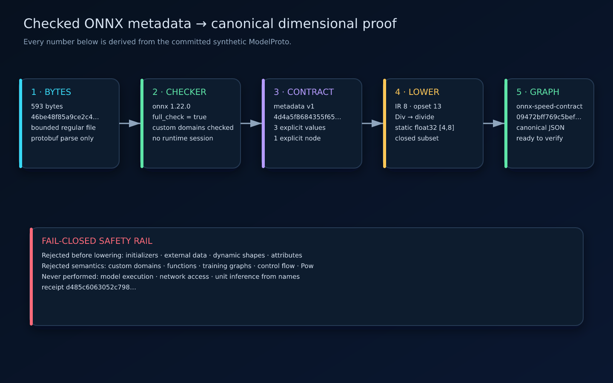

# Architecture and verification boundary

This document separates the implemented verifier, certificate/replay,
bounded-repair, canonical comparison-plan/result, comparison engine, production
CLI, and static ONNX import boundaries. The implementation map at the end is
the authoritative status summary.

## Design objective

Given a bounded computation graph, a versioned unit registry, and optional unit
annotations, the current verifier determines one of four outcomes:

1. `verified`: every value has a unique, consistent dimensional interpretation;
2. `underconstrained`: more than one interpretation remains;
3. `conflict`: a tracked subset of declarations and operations is inconsistent;
4. `unknown`: the trusted verification result could not be established.

Only `verified` may produce a positive proof certificate. A timeout, unsupported
operation, malformed graph, or non-unique interpretation is never converted
into success.

Stable `unknown` reasons cover timeout, memory/resource failure, solver unknown,
contract rejection, out-of-domain model extraction, and internal
inconsistency. Raw solver diagnostics are not exposed.

## Quantity model

### Dimension

A dimension is a seven-component vector ordered as:

```text
length, mass, time, electric-current,
thermodynamic-temperature, amount-of-substance, luminous-intensity
```

Each component is an exact rational exponent. Multiplication adds vectors,
division subtracts them, and exponentiation multiplies every component by the
same bounded rational. Equality is exact; floating-point tolerances do not
participate in type checking.

### Unit

A unit contains:

- a canonical identifier;
- one dimension vector;
- an exact rational scale relative to a canonical reference unit;
- an exact rational offset when the conversion is affine;
- a quantity kind that distinguishes linear values, absolute temperatures, and
  temperature differences.

An affine unit is not generally closed under multiplication, division, or
exponentiation. An absolute Celsius magnitude may be normalized onto the
canonical absolute-temperature reference scale, but that conversion does not
reclassify it as a linear quantity. Direct temperature units must declare
whether they represent an absolute value or a difference; a temperature
difference has no absolute offset.

### Tensor value

The core verifier reasons about a value contract, not tensor payload bytes:

- scalar element type;
- optional symbolic shape;
- dimension or dimension variable;
- optional concrete unit;
- semantic quantity kind;
- source declaration identity.

Shape and dimensional inference are separate. A dimensionally valid graph can
still have an invalid tensor shape, and vice versa.

## Canonical graph format

The implemented core decoder accepts strict JSON with:

- a schema version;
- a bounded, unique list of graph inputs;
- a bounded, unique topological list of nodes;
- declared outputs;
- explicit operation names and closed parameter objects;
- optional unit declarations tied to values;
- no executable code, import path, URL, or extension hook.

Parsing rejects duplicate JSON keys, unknown fields, invalid UTF-8, noncanonical
numbers, cycles, forward references, excessive nesting, and values outside
declared limits. Public witnesses use canonical value/node source identifiers
and constraint identifiers, not host filesystem paths.

## Constraint compilation

Each value receives seven exact dimension expressions plus exact scale, offset,
and semantic quantity-kind expressions. Operations emit labelled equations:

| Operation family | Dimensional rule |
| --- | --- |
| identity | output contract equals input contract |
| add, subtract, minimum, maximum | dimensions match; kind/transform follow the explicit arithmetic truth table |
| multiply, matrix multiplication | output dimension is left plus right |
| divide | output dimension is left minus right |
| power by rational constant | output equals input multiplied by exponent |
| exponential, logarithm, sigmoid, softmax | input and output are dimensionless |
| explicit conversion | dimensions equal; unit transform is declared |

Every equation is tracked by a stable constraint identifier derived from its
graph declaration. Solver-generated names never appear in user-facing output.

### Inference

A satisfiable system is not automatically verified. UnitSentinel asks whether
every dimension component, quantity kind, scale, and offset has a unique value.
If two models assign different values to any observable contract, the graph is
`underconstrained`.

All extracted solver rationals pass a 256-bit numerator/denominator boundary.
Dimension exponents additionally require an absolute numerator no greater than
64 and a denominator no greater than 12 before they enter the domain model.

### Conflict cores

Tracked assertions provide an initial unsatisfiable core. Because solver cores
need not be minimal, UnitSentinel deterministically shrinks the sorted core
within a fixed check budget. The resulting core is a diagnostic witness, not a
proof that every omitted declaration is irrelevant to scientific intent.

## Bounded repair

The implemented repair boundary remains downstream of verification and never
mutates its input. Its v1 operator is deliberately narrow: it can propose
replacing one explicit canonical unit annotation that participates in a freshly
verified deletion-minimal conflict core.

For each bounded eligible site, the implementation removes only that annotation
in memory and requires the relaxed graph to be `verified`. It then enumerates
registry units whose dimension, quantity kind, scale, and offset exactly match
the relaxed value contract, restores each candidate annotation in memory, and
freshly verifies the candidate graph. It returns a proposal only when exactly
one candidate verifies. Unknown outcomes or exhausted limits are indeterminate;
multiple verified candidates, a remaining conflict, or no exact canonical
match cause abstention.

The result binds the source, relaxed, and repaired graph and verification
digests. The CLI exposes the same bounded search as a read-only canonical JSON
report with `application: not-performed`; it has no apply or output-file
surface. A verified dimensional proposal does not establish scientific intent
or permission to change a model. The complete acceptance protocol and aggregate
limits are documented in [unit-repair-v1.md](unit-repair-v1.md).

## Proof certificate

A canonical positive certificate currently binds:

- graph schema version and SHA-256;
- unit registry version and SHA-256;
- verifier version, semantic contract, and solver version;
- the exact configured solver/resource limits and checks performed;
- ordered inferred contracts;
- the complete ordered source-labelled constraint catalog;
- the verified result SHA-256;
- certificate schema version.

The complete canonical certificate bytes are content-addressed by SHA-256; the
digest is computed outside the closed certificate document.

Only an exact runtime `VerificationResult` with status `verified`, complete
contract coverage, matching graph/registry bindings, and freshly revalidated
sources can be issued. Negative and indeterminate outcomes have no certificate
shape.

Detached replay decodes the canonical claim, recomputes its digest, compares
graph and registry identities, compares the current source-labelled catalog,
optionally pins the toolchain, replays every claimed contract against the graph
and registry through solver-independent Python semantics, then performs a fresh
bounded uniqueness verification. It returns `reproduced`, `mismatch`, or
`indeterminate`.

A certificate is an unsigned claim about one bounded verifier execution.
Successful replay establishes current semantic agreement, not that issuance
happened, author identity, or scientific validity. The exact byte contract is
documented in [certificate-format.md](certificate-format.md).

## Training and serving comparison

The canonical alignment plan, bounded plan and result byte codecs,
fresh-verification engine, and immutable result are implemented. The plan
binds the exact training graph, serving graph, registry snapshot, and explicit
logical interface mapping without itself making a compatibility claim.

Mappings operate on public `(role, value_id)` occurrences. Every occurrence
must be covered exactly once before comparison; one-sided bindings express an
explicit absence, cross-role bindings preserve a role drift, and different
identifiers are treated as an intentional rename only under the caller-trusted
plan that pairs them. Constructing or decoding a plan does not establish
endpoint membership, total coverage, or permission; the engine validates
membership and exact occurrence coverage against both bound graphs before
calling either solver. It binds the exact plan digest, exposes
`authentication: not-provided`, and lets a caller-trusted expected digest fail
closed. No fuzzy, positional, or alias-based matching is permitted. Port
positions are compared only within the same role because input and output
ordinals are separate namespaces. The complete plan and result contract is
documented in
[training-serving-comparison-v1.md](training-serving-comparison-v1.md).

Two individually verified graphs may still disagree. Contract comparison
aligns declared public inputs and outputs, then reports exact missing/extra,
role, position, dtype, shape, explicit-unit, dimension, kind, scale, and offset
differences. A negative, underconstrained, unknown, malformed, or
identity-mismatched verifier result produces `indeterminate` with no partial
interface findings.

Both sides are freshly verified with the same registry and solver limits even
when the first ordinary result is not positive. Complete positive assignments
are independently replayed before snapshots are built.

The normalization-lineage extractor and its fresh comparison integration are
implemented. The extractor derives a bounded, content-addressed expression DAG
from one plan-scoped positive verification claim, maps public input roots and
outputs through the explicit comparison plan, collapses only
metadata-preserving identities, and records every dimensionless linear
`divide` site as a counted semantic multiset. Semantic hashes exclude internal
graph, node, and value identifiers; the outer artifact retains those
diagnostics and source digests. The extractor replays and validates a supplied
claim but does not prove it was produced freshly.

The comparison engine supplies that freshness boundary. Only after both graph
results are accepted as complete and replayable does it extract training and
serving lineages, recheck every pinned source between calls, and revalidate the
first lineage after the second extraction. It independently rederives the
complete expected expression DAG, sites, routes, and outputs from each real
graph instead of trusting a candidate's internally consistent hashes. Every
lineage output receives a domain-separated digest over its logical contract ID
and counted routed normalization-site multiset. A two-sided output binding
stores the training and serving digests; a difference adds
`normalization-lineage-drift` after the ordinary interface codes. A malformed,
misbound, incomplete, forged, or mutated lineage makes the whole result
`indeterminate` with
`normalization-lineage-failure`; neither lineage nor partial binding findings
are published.

The strict comparison-result decoder preflights canonical JSON at a 32 MiB
document boundary, reconstructs the complete closed model, recomputes nested
wrapper and semantic digests, and requires exact canonical byte equality. A
graph-count-ceiling stress result with 512 nodes, 385 normalization sites, and
64 outputs measures 7,538,814 bytes but does not maximize every metadata
field. The committed
[shape-only boundary measurement](../tools/measure_comparison_result_boundary.py)
combines deliberately incompatible independent ceilings and measures
24,402,018 bytes and 779,409 preflight tokens; the 32 MiB and
1,048,576-token limits are the next powers of two above it. It is a sizing
stress envelope, not a valid result or proof of the exact maximum.

This codec establishes structural and content-address integrity only. The
decoded result remains unsigned: decoding does not authenticate an author,
prove verifier freshness, rederive lineage from either graph, or show that a
caller approved the plan. Claimed solver limits and check counts do not prove
those resources were enforced. The fresh engine and caller-trusted expected
plan digest remain separate trust boundaries.

The production `compare` command carries those boundaries through files and
process exits. It validates all five solver limits before I/O, hashes and pins
the raw plan before decoding, rejects a registry mismatch before opening
either graph, then hashes and binds training before serving. Both graph reads
are bounded regular-file descriptor snapshots. The strict result encoder runs
for every domain outcome, including when no result path was requested. A
requested result is published as a new mode-`0600` file through the existing
private no-overwrite transaction before stdout is written. Compatible, drift,
and indeterminate are reportable exits `0`, `5`, and `3`; malformed input,
unsafe output, usage, and internal failures remain distinct and emit no
partial report.

The three committed ratio cases execute that public command in text and JSON
modes and require both runs to write identical raw claims. Their canonical
graphs, plans, captures, strict results, exact byte lengths, and cross-bound
provenance regenerate offline. Source-derived terminal, workflow, lineage, and
artifact-size visuals consume those records; the GIF copies the same terminal
SVGs rather than synthesizing a session.

Statistical drift tools remain complementary: UnitSentinel finds semantic
contract skew even when no representative payload samples are available.

## ONNX adapter boundary

The optional adapter is implemented as a preprocessing boundary into the same
canonical graph IR. It uses the `onnx==1.22.0` package as a parser and official
checker; it does not depend on ONNX Runtime, create an inference session, load
external tensors, or execute model code.



*The committed CLI receipt supplies the displayed checker version, source and
contract digests, graph counts, operator mapping, and execution flags.
[Accessible SVG](assets/onnx-adapter-architecture.svg);
[canonical import receipt](evidence/captures/onnx-import.json).*

The accepted source envelope is intentionally exact:

1. one regular `ModelProto` of at most 8,388,608 bytes;
2. ONNX IR version 8 and exactly the default-domain opset 13;
3. `onnx.checker.check_model` with full checking, compatibility checking, and
   custom-domain checking enabled;
4. one canonical metadata value under
   `io.github.omar07ibrahim.unitsentinel.contract`, no larger than 131,072
   bytes and using `unitsentinel.onnx-contract/v1`;
5. complete, sorted, duplicate-free bindings for every graph value and named
   node—units come only from canonical registry IDs or explicit `null`;
6. static rank and dimensions with float16, float32, float64, or bfloat16
   element types; and
7. one-output nodes from this reviewed mapping:
   `Add`, `Div`, `Exp`, `Identity`, `Log`, `MatMul`, `Max`,
   `Min`, `Mul`, `Sigmoid`, `Softmax`, and `Sub`.

The adapter lowers the source names through those explicit bindings, constructs
the ordinary immutable `ComputationGraph`, and lets the existing core enforce
topology, operation, shape metadata, unit, and identifier invariants. The import
receipt binds source bytes, metadata bytes, checker configuration, exact
operator mappings, and the canonical graph digest. It is content-addressed and
unsigned: it authenticates neither an exporter nor a deployment.

Initializers and external tensor data, sparse initializers, symbolic or
unspecified dimensions, attributes, functions, training graphs, custom
domains, quantization annotations, control-flow operators, unreviewed element
types, unknown operators, and partial metadata all fail closed. Import does not
prove broadcasting or matrix-shape correctness, model quality, scientific
correctness, runtime deployment, or authenticity.

The production `import-onnx` command reads a bounded descriptor snapshot and
publishes the canonical graph through a private atomic no-overwrite path before
emitting its receipt. Import success is not dimensional verification; callers
run the ordinary `verify` command on the graph next. The exact metadata and
receipt contracts are specified in [ONNX contract v1](onnx-contract-v1.md).

## Resource and security limits

- No network access is required by verification, replay, repair, comparison,
  or static ONNX import.
- No shell, `eval`, dynamic import, inference session, or arbitrary model
  execution.
- Fixed limits for document bytes/tree shape, inputs, values, nodes, outputs,
  tensor rank, exponent size, core-shrink checks, uniqueness checks, solver
  memory, and solver time.
- Comparison-result transport is separately capped at 33,554,432 canonical
  JSON bytes before model reconstruction.
- Deterministic errors omit host paths, environment values, and raw solver
  diagnostics.
- Unknown unit identifiers and unsupported operations fail closed.
- Canonical JSON readers reject duplicate fields and non-finite numbers.
- The same registry snapshot is used for compilation, certificate issuance,
  replay, and both sides of a comparison.

The threat model excludes a same-UID process that can rewrite the verifier,
solver binary, or repository parent directories during execution. The
reproducible evidence tooling states its separate rendering and filesystem
boundary explicitly.

## Current implementation map

| Area | Current | Next |
| --- | --- | --- |
| Package boundary | Typed exact values, graph, registry, verification/repair/comparison/lineage results, certificates, replay reports, content-addressed comparison plans/import receipts, strict bounded codecs, and production verification/repair/replay/comparison/ONNX-import CLI | Broader formats only after separate review |
| Dimension semantics | Exact bounded rational algebra, graph inference, training/serving interface comparison, and fresh cross-graph normalization-lineage comparison | Extend only with reviewed operator semantics |
| Unit registry | Immutable 33-unit snapshot with pinned SHA-256 | External snapshot decoder |
| Graph IR | Content-addressed bounded IR, strict decoder, and implemented static ONNX lowering | Additional source adapters require explicit contracts |
| Solver | Tracked dimension/kind/scale/offset constraints, uniqueness, replay, bounded cores, repair re-verification, two-sided fresh comparison, and replay-bound lineage comparison | Grouped synthetic fault benchmark |
| Repairs | One bounded, non-mutating, exact-registry annotation replacement with independent verification and abstention | Additional operators require separate design and review |
| Certificates | Positive-only canonical codec, content digest, and detached replay with optional strict-toolchain policy | Signature policy remains deliberately external |
| CLI | Bounded regular-file reads, required plan pinning, stable exits, atomic no-overwrite graph/certificate/result publication, read-only repair reports, and static ONNX import | Expand only with reviewed semantics |
| Visual evidence | Real verification/replay/repair/comparison/ONNX captures, lineage/workflow/lowering diagrams, measured and exact-size plots, three GIFs, accessible SVGs, and a closed digest manifest | Refresh with every behavior change |
